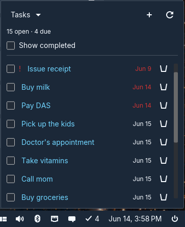
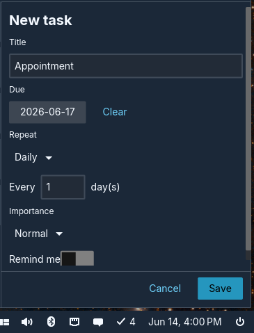

# Outlook Tasks - COSMIC applet

A [COSMIC](https://system76.com/cosmic) panel applet to view, create, edit,
complete, and delete [Microsoft To Do](https://to-do.office.com/) tasks on a
personal **outlook.com** account, straight from the COSMIC panel. It talks to the
Microsoft Graph API and signs you in with OAuth 2.0 (PKCE), keeping tokens in the
system keyring.



*Pending tasks in the popup, sorted by due date with overdue tasks highlighted.*



*Creating a task with a due date, recurrence, importance, and a reminder.*

## Features

- **View** pending tasks sorted by due date, with overdue tasks highlighted, and
  optionally show completed ones.
- **Create, edit, and delete** tasks with due dates, recurrence (daily, weekly,
  monthly, and yearly, including "Nth weekday" patterns like *last Friday*),
  importance, and reminders.
- **Complete** a task in one click from the panel popup.
- **Reminders** surface as desktop notifications via
  `org.freedesktop.Notifications`.
- **Secure sign-in** with Microsoft using OAuth 2.0 with PKCE and a loopback
  redirect; refresh tokens are stored in the system keyring (Secret Service),
  never on disk in plaintext.

## How it works

The project is a Cargo workspace with two crates:

| Crate                                              | Description                                                                                                                                              |
|----------------------------------------------------|----------------------------------------------------------------------------------------------------------------------------------------------------------|
| [`core`](core) (`outlook-tasks-core`)              | The headless library: OAuth/PKCE sign-in, the loopback callback server, token storage in the Secret Service (oo7), and the Microsoft Graph To Do client. |
| [`applet`](applet) (`cosmic-applet-outlook-tasks`) | The [libcosmic](https://github.com/pop-os/libcosmic) panel applet: popup UI, task form, reminder scheduling, and desktop notifications.                  |

HTTP is done with `reqwest` over `rustls` (no OpenSSL). All authentication is
delegated; the applet holds no client secret.

## Runtime requirement

A Secret Service provider (gnome-keyring or KWallet) must be running. COSMIC
ships none by default. Without one, the applet shows a "No keyring found" notice
and sign-in is disabled until you install/start one.

## One-time app registration (Microsoft Entra)

The applet ships with an embedded public client id. To build your own:

1. Microsoft Entra admin center > App registrations > New registration.
2. Supported account types: **Personal Microsoft accounts only**.
3. Add a platform > **Mobile and desktop applications** > redirect URI
   `http://localhost`.
4. Authentication > **Allow public client flows** > Yes. (No client secret.)
5. API permissions > Microsoft Graph > Delegated > add `Tasks.ReadWrite`,
   `offline_access`, `openid`.
6. Copy the Application (client) ID.

> Loopback note: the applet advertises `http://localhost:<port>/` and listens on
> `127.0.0.1`. This works wherever `localhost` resolves to `127.0.0.1` (the norm).
> On a host whose resolver prefers IPv6 `::1`, register `http://127.0.0.1` instead
> (added via the app manifest's `replyUrlsWithType`, since the portal text box
> rejects an http-scheme `127.0.0.1`) and the listener will still match.

## Build & install

Requires Rust 1.92+ and [`just`](https://github.com/casey/just). Pass your client
id through the `OUTLOOK_TASKS_CLIENT_ID` environment variable at build time:

```bash
OUTLOOK_TASKS_CLIENT_ID=<your-client-id> just build-release
sudo just install
```

Then add "Outlook Tasks" to the panel via COSMIC Settings > Panel/Dock > Applets.

A [Flatpak manifest](flatpak/dev.robledop.OutlookTasks.json) is also provided.

### Other `just` targets

| Command | What it does |
| --- | --- |
| `just run` | Run the applet locally (`cosmic applet run`). |
| `just check` | Clippy across the workspace (`-W clippy::pedantic`). |
| `just test` | Run the workspace test suite. |
| `just install` / `just uninstall` | Install/remove the binary, desktop entry, icons, and metainfo (use `sudo` for a system prefix). |

## License

[GPL-3.0-only](LICENSE).
